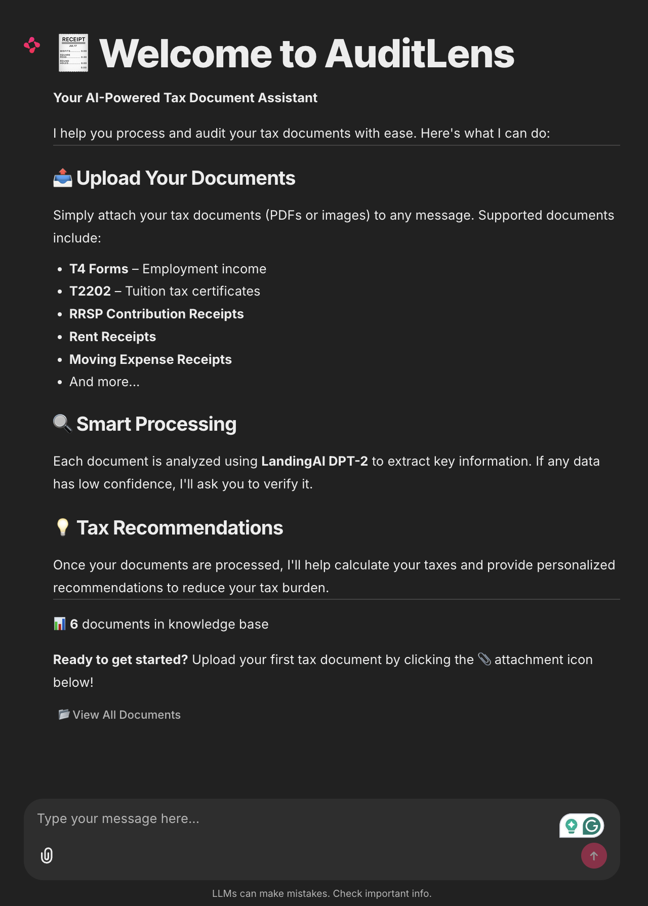
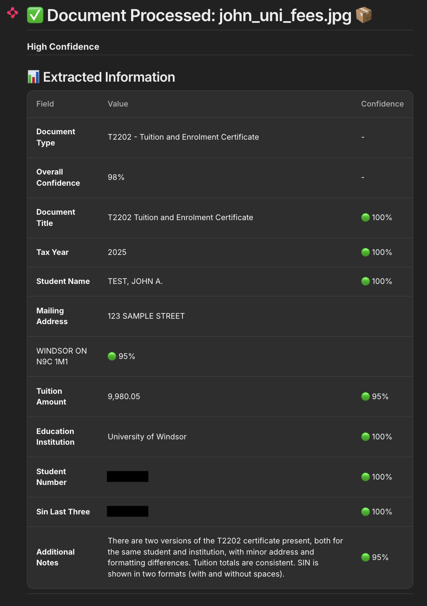
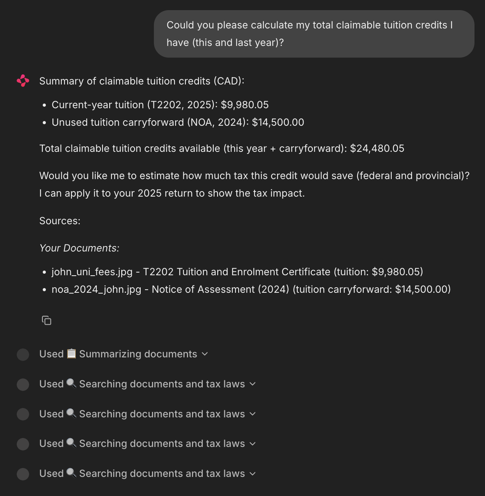
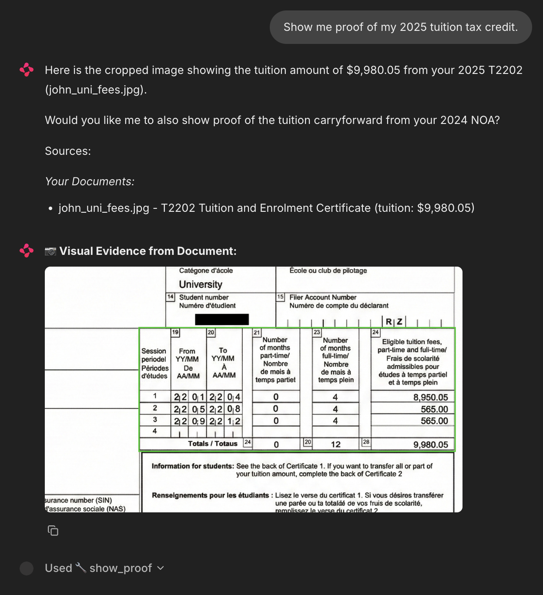
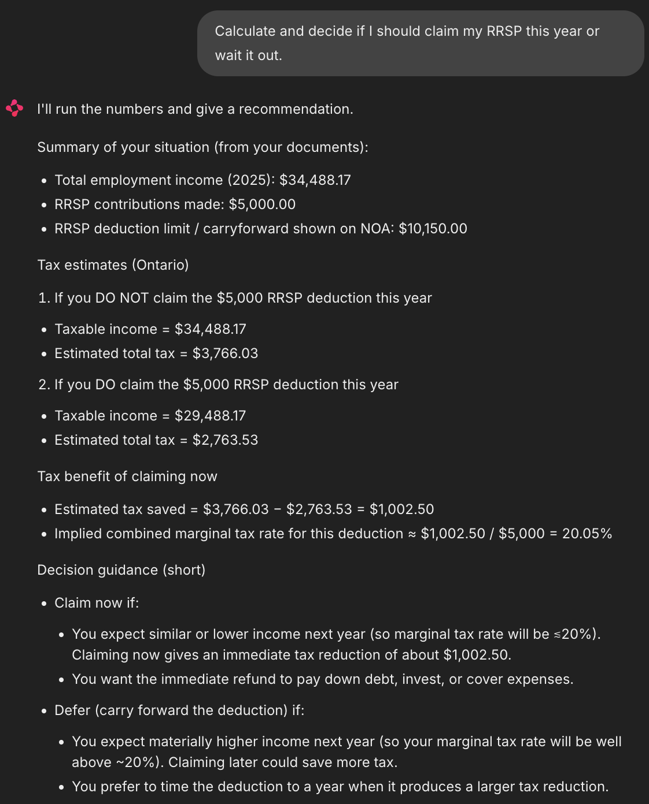

# AuditLens 🧾✨

An AI-powered Canadian Tax Assistant that makes tax filing simple, accurate, and auditable.


## Overview

AuditLens is an intelligent tax filing assistant that helps Canadian taxpayers:

- **Upload and parse tax documents** using AI-powered document understanding
- **Extract key fields** from T4s, T5s, RRSP receipts, tuition slips, NOAs, and more
- **Verify identity** across documents to ensure consistency
- **Calculate taxes** with federal and provincial estimates
- **Get personalized advice** on RRSP, FHSA, tuition credits, and carry-forwards
- **Generate professional reports** for tax software population

## 💡 Why Did I Build This?

I have been filing taxes in Canada since 2021, all on my own (because I enjoy math and accounting). I have even helped my friends and roommates file their taxes in exchange for lunch or drinks (and I still do!). Although I liked filing taxes, I found the process can be tedious and time-consuming for most people, and I wanted to make it easier for them to file their own taxes.

I built AuditLens to make tax filing simple and accessible for everyone. Tax documents can be messy, complex, diverse, and hard for computers to understand by computers. Tax laws are also complex and hard to understand by computers, and change periodically. Tax software is also complex and hard to understand, and can be expensive. There is also a need for auditability and explainability, to ensure that users can understand how the AI arrived at its conclusions and to help explain the decision-making process in case of CRA audits.

Modern technology, such as LLMs, agentic AI, agentic document parsing, and vector databases have immense potential to reduce this complexity and make tax filing simple and accessible for everyone. Most people are afraid of filing taxes out of fear of being audited by the CRA. The project puts strong emphasis on explainability and auditability, to ensure that users can understand how the AI arrived at its conclusions and to help explain the decision-making process in case of CRA audits.

I hope this project will help make tax filing simple and accessible for everyone, and potentially inspire others to build similar tools that can have a real impact on people's lives. I also hope this project would eventually be used by tax clinics, immigration settlement agencies, and non-profits to help their clients file their taxes, such as new immigrants or people with low incomes.

I welcome open-source contributions to make this project better, and any feedback and suggestions are appreciated.

## Screenshots

### Welcome Screen


### Document Parsing
Upload a tax document and watch AI extract all relevant fields with confidence scores.



### Query Example: Tuition Credits
Ask natural language questions about your tax documents.



### Visual Proof
Request proof of extracted values - see exactly where the data came from.



### Tax Advice: RRSP Carry-Forward
Get personalized recommendations based on your NOA carry-forward data.



## Features

### 📄 Smart Document Parsing
- Powered by LandingAI's agentic document parsing
- Supports T4, T5, T2202, RRSP/FHSA receipts, NOA, rent receipts, and more
- Visual proof extraction - see exactly where values came from - useful for audits and explainability

### 🤖 Dual AI Agents
- **Tax Agent**: Handles calculations, document queries, and tax tips
- **Tax Filing Agent**: Guides through the filing process with CRA rule search

### 🔍 Vector-Based Search
- ChromaDB for semantic document and tax law search
- Multi-collection architecture (user documents + tax laws)

### ✅ Identity Verification
- Fuzzy matching across documents (name, address, SIN)
- Discrepancy detection and alerts

### 📊 Tax Optimization
- NOA-based carry-forward analysis (RRSP room, tuition credits, capital losses)
- FHSA contribution guidance
- Year-over-year income comparison

### 📋 Report Generation
- Professional HTML tax reports
- Audit trail for user-provided information

## Tech Stack

| Component | Technology |
|-----------|------------|
| Frontend | [Chainlit](https://chainlit.io) |
| Document Parsing | [LandingAI Agentic Doc](https://landing.ai) |
| LLM | OpenAI GPT-5-mini |
| Embeddings | OpenAI text-embedding-3-small |
| Vector Store | ChromaDB |
| Agent Framework | LangChain |

## Architectural Decisions

### Why Dual-Store RAG?

I chose to decouple the **Document Store** (ephemeral, user-uploaded documents) from the **Policy Store** (static tax laws and CRA rules). This architecture ensures:

- The Agent doesn't confuse a specific invoice line item with a general tax rule
- Tax laws can be updated independently without re-indexing user documents
- Cleaner separation of concerns for audit and compliance purposes
- Scalability: millions of user documents won't pollute the policy search space

### Why Chainlit?

For an audit tool, **explainability is the P0 requirement**. Chainlit provides:

- "Chain of Thought" visualization out-of-the-box
- Step-by-step tool execution visibility
- The ability to verify exactly *why* the Agent flagged a specific field
- Native streaming and async support for responsive UX

### Target Users

| Segment | Use Case |
|---------|----------|
| **Individuals** | Speed up personal tax processing, reduce errors |
| **Tax Clinics** | Reduce burden on volunteers, handle more clients |
| **Non-profits** | Organizations without dedicated accounting teams |
| **Small Businesses** | Owners managing their own T4s and receipts |

### Future Improvements (Production Roadmap)

1. **Browser Extension** — Auto-fill web-based tax software (Wealthsimple Tax, TurboTax, etc.) using the agent. Goal: generalize over any tax software UI.

2. **Automated Tax Filing** — Direct API connection for e-filing (requires CRA NETFILE certification and certified tax software approval).

3. **Multi-Year Analysis** — Compare tax returns across years for trend analysis and audit preparation.

4. **OCR Fallback** — Local OCR-based fallback for when LandingAI is unavailable (with structured document parsing).

5. **Mobile Document Capture** — Camera-based document scanning with edge detection.

## Installation

### Prerequisites

- Python 3.10 or higher
- pip (Python package manager)

### 1. Clone the Repository

```bash
git clone https://github.com/yourusername/auditlens.git
cd auditlens
```

### 2. Create Virtual Environment (Recommended)

```bash
python -m venv venv
source venv/bin/activate  # On Windows: venv\Scripts\activate
```

### 3. Install Dependencies

```bash
pip install -r requirements.txt
```

You may also need to install DuckDuckGo search for CRA rule lookup:

```bash
pip install duckduckgo-search
```

### 4. Set Up Environment Variables

Create a `.env` file in the project root:

```env
# Required: OpenAI API Key
OPENAI_API_KEY=sk-your-openai-api-key-here

# Optional: OpenAI Model (default: gpt-5-mini)
OPENAI_MODEL=gpt-5-mini

# Required: LandingAI Model (for document parsing)
LANDINGAI_MODEL=dpt-2-mini-latest
```

## Getting API Keys

### OpenAI API Key

1. Go to [OpenAI Platform](https://platform.openai.com)
2. Sign up or log in
3. Navigate to **API Keys** section
4. Click **Create new secret key**
5. Copy the key and add it to your `.env` file

### LandingAI (Required for document parsing)

1. Visit [LandingAI](https://va.landing.ai)
2. Sign up for an account
3. Access the document parsing API
4. Use the model name `dpt-2-mini-latest` in your `.env`

> **Note**: LandingAI is required for document parsing. Without it, document upload features will not function.

## Running the App

### Development Mode (with auto-reload)

```bash
chainlit run app.py -w
```

### Production Mode

```bash
chainlit run app.py
```

The app will be available at `http://localhost:8000`

### Custom Port

```bash
chainlit run app.py -w --port 3000
```

## Usage

### 1. Upload Documents

Drag and drop your tax documents into the chat:
- T4 (Employment Income)
- T5 (Investment Income)
- T2202 (Tuition)
- RRSP/FHSA Contribution Receipts
- Notice of Assessment (NOA)
- Rent Receipts

### 2. Ask Questions

```
"How much tax do I owe?"
"Summarize my documents"
"What is my RRSP contribution room?"
"Show me the tuition amount from my T2202"
```

### 3. Get Filing Help

```
"Help me file my taxes"
"What documents am I missing?"
"Generate my tax report"
```

### 4. Corrections

```
"The income is actually $52,000"
"Update the rent to $1500"
```

## Project Structure

```
auditlens/
├── app.py                 # Main Chainlit application
├── chainlit.md            # Welcome screen content
├── requirements.txt       # Python dependencies
├── .env                   # Environment variables (create this)
│
├── services/
│   ├── document_parser.py # LandingAI document parsing
│   ├── tax_agent.py       # Main tax calculation agent
│   ├── tax_filing_agent.py# Tax filing guidance agent
│   ├── vector_store.py    # ChromaDB vector store
│   ├── user_profile.py    # Identity verification
│   └── ...
│
├── data/
│   └── tax_laws/          # Canadian tax law documents
│
├── uploads/               # Uploaded document storage
│   └── reports/           # Generated HTML reports
│
├── chroma_db/             # Vector database storage
│
└── public/                # Static assets
```

## Configuration

### Chainlit Settings

Edit `.chainlit/config.toml` for:
- Theme customization
- Session settings
- Feature flags

### Tax Year

The current tax year is configured in `services/tax_filing_agent.py`:

```python
CURRENT_TAX_YEAR = "2025"
```

## Supported Document Types

| Document | Description | Key Fields Extracted |
|----------|-------------|---------------------|
| T4 | Employment Income | Employment income, CPP, EI, tax deducted |
| T5 | Investment Income | Dividends, interest income |
| T2202 | Tuition Certificate | Tuition amount, months enrolled |
| RRSP Receipt | Contribution Receipt | Contribution amount, issuer |
| FHSA Receipt | First Home Savings | Contribution amount |
| NOA | Notice of Assessment | RRSP room, carry-forwards, refund/owing |
| Rent Receipt | Rental Payment | Monthly rent, landlord, address |

## Troubleshooting

### "OPENAI_API_KEY not found"

Ensure your `.env` file is in the project root and contains:
```env
OPENAI_API_KEY=sk-your-key-here
```

### Document parsing fails

1. Check that `LANDINGAI_MODEL` is set correctly
2. Ensure the document is a clear image or PDF
3. Try re-uploading the document

### Vector store errors

Delete the `chroma_db/` directory and restart the app to rebuild:
```bash
rm -rf chroma_db/
chainlit run app.py -w
```

## Contributing

1. Fork the repository
2. Create a feature branch (`git checkout -b feature/amazing-feature`)
3. Commit your changes (`git commit -m 'Add amazing feature'`)
4. Push to the branch (`git push origin feature/amazing-feature`)
5. Open a Pull Request

## ⚠️ Disclaimers & Legal

> **NOT PROFESSIONAL TAX ADVICE**
> 
> AuditLens is an educational and productivity tool. It is **not a substitute for professional tax advice** from a certified accountant or tax professional. Always consult a qualified professional for complex tax situations.

> **NO WARRANTY**
> 
> This software is provided "as is" without warranty of any kind. The developers are not liable for any errors, omissions, or inaccuracies in tax calculations or advice generated by this tool.

> **DATA PRIVACY**
> 
> - Your documents are processed locally and via third-party APIs (LandingAI, OpenAI)
> - Sensitive data (SIN, income) is transmitted to these services for processing
> - Review the privacy policies of [LandingAI](https://landing.ai/privacy-policy) and [OpenAI](https://openai.com/privacy) before use
> - **Do not use this tool if you are uncomfortable with third-party data processing**

> **USER RESPONSIBILITY**
> 
> - Verify all extracted values before filing your taxes
> - The user is solely responsible for the accuracy of their tax return
> - AI-generated advice may contain errors - always double-check with official CRA sources

> **NOT CRA AFFILIATED**
> 
> This tool is not affiliated with, endorsed by, or connected to the Canada Revenue Agency (CRA) or the Government of Canada.

## License

This project is licensed under the MIT License - see the [LICENSE](LICENSE) file for details.

## Acknowledgments

- [Chainlit](https://chainlit.io) for the conversational UI framework
- [LandingAI](https://landing.ai) for document parsing capabilities
- [LangChain](https://langchain.com) for the agent framework
- [ChromaDB](https://trychroma.com) for vector storage

---

Built with ❤️ for Canadian taxpayers
